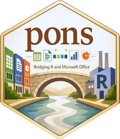

# pons 

<!-- badges: start -->
[](https://lifecycle.r-lib.org/articles/stages.html#experimental)
[-blue.svg)](https://www.gnu.org/licenses/gpl-2.0.html)
[](https://github.com/AndriSignorell/pons/actions/workflows/R-CMD-check.yaml)
<!-- badges: end -->

> **pons** *(Latin: "bridge")* — a bridge between R and Microsoft Office.

**pons** provides the MS-Office interface routines used throughout the
[DescToolsX](https://github.com/AndriSignorell) ecosystem. It lets you drive
Microsoft **Word** and **Excel** from R via
[RDCOMClient](http://www.omegahat.net/RDCOMClient/): read and write ranges,
move data both ways, and build reproducible reports without leaving the R
console.

## Features

- **Excel data transfer** — read the selected range(s) straight into a
  `data.frame`, `matrix`, `list` or cross-`table`, with an interactive dialog
  that also inserts ready-to-run code at your editor cursor.
- **View data in Excel** — send any data frame to a fresh, formatted worksheet
  for interactive inspection.
- **Word automation** — insert text and objects, and create, rename, move to,
  or delete bookmarks in the active document.
- **Session management** — get, set, create, close, or temporarily switch the
  active Word / Excel instance.

## Installation

**pons** is not on CRAN. Install the development version from GitHub:

```r
# install.packages("remotes")
remotes::install_github("AndriSignorell/pons")
```

`RDCOMClient` lives on the Omegahat repository and is Windows-only (it relies on
COM automation). If it is not pulled in automatically, install it directly:

```r
install.packages("RDCOMClient", repos = "http://www.omegahat.net/R")
```

> **Note.** MS-Office automation requires a local installation of Microsoft
> Office on Windows. The COM-based functions do not work on macOS or Linux.

## Getting data out of Excel

Select a range in Excel, then let **pons** bring it into R. The interactive
importer reads your current selection, asks how to organize it, and either
returns / assigns the object or drops constructive code at your cursor:

```r
library(pons)

xl <- getXl()      # attach the running Excel instance
xlImport(xl)       # select a range in Excel first, then run this
```

Prefer to script it? The two building blocks under `xlImport()` are available
on their own:

```r
r <- xlGetRange(xl)                            # raw values + metadata
attr(r, "address")                             # e.g. "A1:B34"

xlParseRange(r, as = "data.frame", header = TRUE)
xlParseRange(r, as = "matrix")
xlParseRange(r, as = "table")   # 1st column -> rownames, 1st row -> colnames
```

Several disjoint areas (e.g. `A1:A4` **and** `C3:D5`) are supported too: they
can be returned as a list of matrices, or bound column-wise into a single
`data.frame` (shorter columns padded with `NA`).

## Getting data into Excel

Push a data frame to a new, formatted worksheet:

```r
xlView(iris)                    # opens iris in a fresh Excel sheet
xlView(mtcars, freeze = TRUE)   # with a frozen header row
```

## Automating Word

Write to the active Word document and manage bookmarks:

```r
wrd <- newWrd()                          # start a new Word session
toWrd("Hello World")                     # insert text
toWrd(c("Line 1", "Line 2"), bullet = TRUE)

wrdAddBookmark("results")                # bookmark the cursor position
replaceBookmarkText("results", "42%")    # fill it in later
wrdGoto("results")                       # jump back to it
```

## Function overview

### Excel

| Function | Purpose |
|---|---|
| `xlImport()` | Interactive, dialog-driven import of the selected range |
| `xlGetRange()` | Read the raw values of the selected range(s) |
| `xlParseRange()` | Organize raw range data into df / matrix / list / table |
| `xlDataTransferDialog()` | Tcl/Tk front-end used by `xlImport()` |
| `xlView()`, `xxlView()` | Open a data frame in Excel |
| `getXl()`, `setXl()`, `newXl()`, `closeXl()`, `withXl()` | Session management |

### Word

| Function | Purpose |
|---|---|
| `toWrd()` | Insert content into the active document |
| `wrdAddBookmark()`, `wrdBookmark()`, `wrdDeleteBookmark()` | Manage bookmarks |
| `renameBookmark()`, `replaceBookmarkText()` | Edit bookmarks |
| `wrdGoto()`, `bookmarkList()` | Navigate / list bookmarks |
| `wdConst` | Word automation constants |
| `getWrd()`, `setWrd()`, `newWrd()`, `closeWrd()`, `withWrd()` | Session management |

### Utilities

| Function | Purpose |
|---|---|
| `cmToPts()`, `ptsToCm()` | Convert between centimeters and typographic points |

## Related packages

**pons** is part of the **DescToolsX** ecosystem and is built to work alongside
`bedrock`, `pharos`, and the other component packages.

## Getting help

- Documentation: <https://andrisignorell.github.io/pons/>
- Bug reports and feature requests:
  <https://github.com/AndriSignorell/pons/issues>

## License

GPL (>= 2) © Andri Signorell
